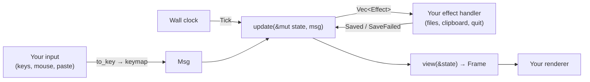

# Embedding caretline

There are two ways to put caretline in your project:

| Way | You get | Best when |
|---|---|---|
| [As a library](#as-a-library) | `State`, `update` and `view` in your Rust process | Your app is in Rust and owns its terminal or window |
| [As a process](#as-a-process) | `caretline serve` speaking JSON lines | Your app is in another language, or you want isolation |

Either way, your app adds what its text means through the [extension points](#extending-the-engine).

Either way, caretline owns the editing rules and you own everything else: input, drawing,
files, the clipboard and the clock.

## As a library

### Add the dependency

caretline is on [crates.io](https://crates.io/crates/caretline): `cargo add caretline`, or

```toml
[dependencies]
caretline = "0.3"
```

Its library is `caretline::`; this repository's crate is the same code. For something on
`main` that is newer than the latest release, use a git dependency on this repository.

The engine leaves serde_json's features alone: it turns on neither `preserve_order` nor
`arbitrary_precision`, so adding it doesn't change how `serde_json::Map` orders keys or how
numbers parse anywhere in your build. If your app enables either, the engine's JSON (states,
traces, messages, mark payloads, protocol responses) comes out the same; CI tests it with
each.

The crate has no terminal dependency, so it works
under any renderer.

### Your event loop

You own the loop. Each turn:

1. Turn your input into a `Msg`. For keys, convert to `caretline::Key` and call
   `keymap`; for paste, resize and mouse events, build the message directly.
2. Send `Msg::Tick { now_ms }` with the wall clock, so typing groups into undo steps. A tick
   never moves the view, so it doesn't undo where a click or a drag left it, and it doesn't
   settle the view either: after you replace the state or set a view's selection, scroll or
   size yourself, call `caretline::layout::ensure_caret_visible(&mut state)` (or send
   `Msg::resize`) to bring the caret into view
   ([messages.md](messages.md#which-messages-move-the-view)).
3. Call `update` and perform the effects it returns.
4. Call `view` and copy the cells to your screen. Put your cursor at `frame.cursor`.

If your app keeps char positions of its own in the text (anchors for hints, bookmarks, a
remote cursor), call `update_with_changes` in step 3 instead: it returns the effects and the
message's text changes, one `ChangeSet` (`None` when the text didn't change), and you map each
position with `changes.map_pos(pos, Assoc::After)` (or `Assoc::Before` to stay before text
inserted exactly there). The engine keeps no history of them, so map right after each message.
`update_doc_with_changes` and `Session::apply_with_changes` do the same for several views and
for a session. See [api.md](api.md#map-your-own-positions-through-each-message);
[caretline-layers](layers.md) moves its anchors this way.



### A minimal ratatui embed

A complete editor in one file, with ratatui 0.30 and crossterm 0.29. It types, moves,
selects and undoes; `Ctrl-Q` twice quits and prints the text.

```toml
[dependencies]
caretline = "0.3"
ratatui = "0.30"
crossterm = "0.29"
```

```rust
use std::time::{SystemTime, UNIX_EPOCH};

use caretline::view::Role;
use caretline::{keymap, update, view, Effect, Key, KeyCode, Mods, Msg, State, Viewport};
use crossterm::event::{self, Event, KeyEventKind, KeyModifiers};
use ratatui::layout::Rect;
use ratatui::style::{Modifier, Style};
use ratatui::Frame;

/// Your key type to caretline's. Keys caretline doesn't know return None.
fn to_key(k: &event::KeyEvent) -> Option<Key> {
    use event::KeyCode as C;
    let code = match k.code {
        C::Char(c) => KeyCode::Char(c),
        C::Enter => KeyCode::Enter,
        C::Backspace => KeyCode::Backspace,
        C::Delete => KeyCode::Delete,
        C::Left => KeyCode::Left,
        C::Right => KeyCode::Right,
        C::Up => KeyCode::Up,
        C::Down => KeyCode::Down,
        C::Home => KeyCode::Home,
        C::End => KeyCode::End,
        C::PageUp => KeyCode::PageUp,
        C::PageDown => KeyCode::PageDown,
        C::Tab => KeyCode::Tab,
        C::Esc => KeyCode::Esc,
        _ => return None,
    };
    let m = k.modifiers;
    let mods = Mods {
        shift: m.contains(KeyModifiers::SHIFT),
        ctrl: m.contains(KeyModifiers::CONTROL),
        alt: m.contains(KeyModifiers::ALT),
        cmd: m.contains(KeyModifiers::SUPER),
    };
    Some(Key { code, mods })
}

/// Copies caretline's frame into a ratatui area. The status row is the frame's last row.
fn draw_editor(f: &mut Frame, area: Rect, state: &State) {
    let frame = view(state);
    let buf = f.buffer_mut();
    for y in 0..frame.height.min(area.height) {
        for x in 0..frame.width.min(area.width) {
            let cell = frame.cell(x, y);
            if cell.symbol.is_empty() {
                continue; // the second half of a wide grapheme
            }
            let style = match cell.role {
                Role::Text => Style::default(),
                Role::Selection => Style::default().add_modifier(Modifier::REVERSED),
                Role::Status | Role::StatusAccent | Role::Hang => Style::default().add_modifier(Modifier::DIM),
                // A role a host named in a decoration: `frame.role_name(cell.role)` says which.
                Role::Named(_) => Style::default(),
            };
            buf.set_string(area.x + x, area.y + y, &cell.symbol, style);
        }
    }
    if let Some((x, y)) = frame.cursor {
        f.set_cursor_position((area.x + x, area.y + y));
    }
}

fn now_ms() -> u64 {
    SystemTime::now().duration_since(UNIX_EPOCH).map(|d| d.as_millis() as u64).unwrap_or(0)
}

fn main() -> std::io::Result<()> {
    let mut terminal = ratatui::init();
    let size = terminal.size()?;
    let mut state = State::new("Edit me.\n", None, Viewport { width: size.width, height: size.height });

    'outer: loop {
        terminal.draw(|f| draw_editor(f, f.area(), &state))?;
        let msg = match event::read()? {
            Event::Key(k) if k.kind == KeyEventKind::Press => match to_key(&k).and_then(|k| keymap(&k)) {
                Some(msg) => msg,
                None => continue,
            },
            Event::Paste(text) => Msg::Paste { text: Some(text) },
            Event::Resize(width, height) => Msg::resize(width, height),
            _ => continue,
        };
        update(&mut state, Msg::Tick { now_ms: now_ms() });
        for effect in update(&mut state, msg) {
            match effect {
                Effect::Quit => break 'outer,
                Effect::ClipboardSet { .. } => {} // hand it to your clipboard
                Effect::WriteFile { .. } => {}    // write it, then send Msg::Saved
                _ => {} // notices, block changes, host effects (`Effect` is non-exhaustive)
            }
        }
    }
    ratatui::restore();
    println!("{}", state.doc.text);
    Ok(())
}
```

For a fuller runtime (mouse, the system clipboard, atomic saves, kitty keyboard flags,
traces), read the `caretline` binary's
[`runtime.rs`](../crates/caretline-cli/src/runtime.rs).

For your own renderer:

- The frame's size is the state's viewport. When your area changes size, send
  `Msg::resize(width, height)`; `update` keeps the caret in view. If you draw pixels over the
  cells, send the cell's size in device pixels too, `Msg::Resize { width, height, cell_px:
  Some(CellPx::new(w, h)) }`: it is kept in `View::cell_px` and copied to `Frame::cell_px`, so
  what you draw from it replays like the rest of the state. A resize without it keeps the
  view's.
- The last row of every frame is caretline's status bar (file name, `[+]`, messages,
  `line:col`). There's no option to turn it off yet; if you don't want it, give the state one
  extra row and don't copy the last one.
- Mouse cells map directly: send `Msg::Click { col, row, extend }` with coordinates relative
  to your area, `Msg::Drag { col, row }` while the button is held and the pointer moves, and
  `Msg::Scroll { rows }` for the wheel. A drag on the first or last text row scrolls one row;
  to keep scrolling while the pointer is held still there, re-send the same `Drag` on a timer
  of yours (the `caretline` editor uses about 50 ms) until the button is released, the pointer
  leaves the edge or a drag no longer scrolls ([messages.md](messages.md#selecting-by-dragging)).
- `Msg` is `#[non_exhaustive]`, as `Effect` is: a `match` on a message ends with a `_` arm.

### Panels: several independent editors

Each `State` is a whole editor with its own text, selection, undo history and viewport. For
several panels, keep several states. Route input to the focused one and give each its own
area.

```rust
use caretline::{update, Effect, Msg, State, Viewport};
use ratatui::layout::{Constraint, Layout, Rect};

/// One editor per panel. Each has its own text, selection, undo history and viewport.
struct Panels {
    editors: Vec<State>,
    focus: usize,
    clipboard: String, // shared between panels
}

impl Panels {
    fn new(texts: &[&str]) -> Panels {
        let vp = Viewport { width: 1, height: 1 }; // set by layout() before the first draw
        Panels {
            editors: texts.iter().map(|t| State::new(t, None, vp)).collect(),
            focus: 0,
            clipboard: String::new(),
        }
    }

    /// Splits the screen and tells each editor its size.
    fn layout(&mut self, area: Rect) -> Vec<Rect> {
        let n = self.editors.len() as u32;
        let rects = Layout::horizontal((0..n).map(|_| Constraint::Ratio(1, n))).split(area);
        for (state, r) in self.editors.iter_mut().zip(rects.iter()) {
            if (state.view.viewport.width, state.view.viewport.height) != (r.width, r.height) {
                update(state, Msg::resize(r.width, r.height));
            }
        }
        rects.to_vec()
    }

    /// Input goes to the focused editor only. Paste uses the shared clipboard.
    fn send(&mut self, msg: Msg) {
        let msg = match msg {
            Msg::Paste { text: None } => Msg::Paste { text: Some(self.clipboard.clone()) },
            m => m,
        };
        for effect in update(&mut self.editors[self.focus], msg) {
            if let Effect::ClipboardSet { text } = effect {
                self.clipboard = text;
            }
        }
    }
}
```

Draw each panel with `draw_editor(f, rects[i], &panels.editors[i])` from the example above.

- **The clipboard register is per state.** To share copy and paste between panels, keep
  the text from `ClipboardSet` yourself and paste it with `Paste { text: Some(..) }`, as
  above.
- **Saving and undo are per state.** Give each state its own `path`.
- **Two panels on the same document** are one `Document` with a `View` each, driven with
  `update_doc`: an edit in one maps the other's selection, and undo is the document's. See
  [api.md](api.md#several-views-of-one-document). `update_doc_with_changes` also returns the
  document's text changes, to map positions your app keeps.
- **Persist the layout** by saving each state with `to_json`. Reopening restores the text,
  the caret, the scroll and the undo history.

### A one-line field

A filter box, a command palette's query or a prompt is a state with `config.single_line` on:
the full editor (undo, word motion, selections, several carets) on a text that never holds a
line break. Line breaks pasted or typed into it become spaces, the line scrolls sideways
instead of wrapping, and Up and Down go to the start and the end
([messages.md](messages.md#editing)).

1. Turn on `doc.config.single_line`, turn off `view.config.status_bar`, give it a viewport one
   row high, and call `sanitize`.
2. Bind Enter to your submit in your own keymap, before the engine's: in a one-line document
   `insert_newline` changes nothing. To keep the submit in traces, an input rule can take
   `InsertNewline` instead and return an `Edit` whose `effects` carry it.
3. Validate with input rules. The value is the text, so it stays exact: a decimal amount is the
   string the person typed, which you parse with your own decimal type, never through a float.

```rust
use caretline::{update, Edit, Host, Msg, State, Viewport};

let mut field = State::new("", None, Viewport { width: 24, height: 1 });
field.doc.config.single_line = true;
field.view.config.status_bar = false;
field.sanitize();
// Digits and at most one point: anything that would break that is refused, with a word why.
field.doc.set_host(Host::new().input_rule("amount", |ctx, msg| {
    let text = match msg {
        Msg::InsertText { text } | Msg::Paste { text: Some(text) } => text,
        _ => return None,
    };
    let r = ctx.selection().primary();
    let mut next = ctx.text().to_string();
    next.replace_range(ctx.text().char_to_byte(r.from())..ctx.text().char_to_byte(r.to()), text);
    let decimal = next.chars().all(|c| c.is_ascii_digit() || c == '.') && next.matches('.').count() <= 1;
    (!decimal).then(|| Edit::status("a decimal amount"))
}));
for msg in [Msg::InsertText { text: "12.5".into() }, Msg::InsertText { text: ".".into() }, Msg::InsertNewline] {
    update(&mut field, msg);
}
assert_eq!(field.doc.text.to_string(), "12.5");
```

## Extending the engine

caretline edits text and knows its shape (blocks, depth, markers), never its meaning. What a
line *means* in your app (a task, a ticket, a status) you add through these extension points,
registered on a `Host` and set on the document:

| Point | Register | Runs |
|---|---|---|
| [Host commands](#host-commands) | `Host::command(name, f)` | `Msg::Command { name, args }`: one transaction, one undo step |
| [Input rules](#input-rules) | `Host::input_rule(name, f)` | Before the engine handles an editing message; the first to return an edit takes it |
| [Mark payloads](#mark-payloads) | (data, not code) | Carried with each block's mark |
| [Decorations](#decorations) | `Host::decorator(f)` | When a view with an outline layout is drawn or hit-tested |
| [View values and ext reducers](#view-values-and-ext-reducers) | `Host::ext(key, ExtFns::new(apply).with_observe(observe))` | `apply` for `Msg::Ext { key, op }` on the acting view; `observe` after every message, on each view holding the key |
| [Frame passes](#frame-passes) | `Host::frame_pass(name, f)` | At the end of every `view::render`, drawing over the frame |
| [Catalog entries](#catalog-entries-and-protocol-ops) | `Host::catalog(entries)` | Listed by the protocol's `hello`, `commands.list` and `keymap.get` |
| [Protocol ops](#catalog-entries-and-protocol-ops) | `Host::op(name, OpFns::new(to_msgs))` | A protocol request whose `op` is `name`: turned into messages, applied and traced |

```rust
use caretline::{Edit, Host, State};

let host = Host::new()
    .command("shout", |ctx, _args| {
        let line = ctx.text().char_to_line(ctx.caret());
        let (a, b) = (ctx.text().line_to_char(line), ctx.text().line_to_char(line + 1) - 1);
        Ok(Edit { changes: vec![(a, b, ctx.text().slice(a..b).to_string().to_uppercase())], ..Edit::default() })
    });
let mut state = State::new("hello\nworld\n", None, caretline::Viewport { width: 40, height: 6 });
state.doc.set_host(host);
caretline::update(&mut state, caretline::Msg::Command { name: "shout".into(), args: serde_json::Value::Null });
assert_eq!(state.doc.text.to_string(), "HELLO\nworld\n");
```

**Every extension is a pure function**: no clock, randomness or I/O, the same answer for the
same document, view and arguments. That is what keeps the engine's promises:

- **State** stays one serializable value. The host is not part of it (it compares equal to any
  other host and is never serialized); a state read from JSON has none until you `set_host`.
- **Replay** stays exact. A command is a message, so traces record it; replay a trace that uses
  commands with `trace::replay_trace_with(input, &host)`, registering the same functions.
- **The protocol** keeps working: `msgs` can send `{"msg":"command","name":…,"args":…}` and
  `{"msg":"ext","key":…,"op":…}`, `hello` and `commands.list` name the registered commands,
  catalog entries and ops, a host's op is answered like the protocol's own, and `state.set`
  keeps the session's host.

### Host commands

A command gets a `Ctx` (the document and the view it acts through: `text()`, `blocks()`,
`selection()`, `caret()`, `mapped_selection(changes)`) and the message's JSON `args`, and
returns an `Edit` or the reason it can't run (shown in the status bar, nothing changed):

| `Edit` field | Meaning |
|---|---|
| `changes` | `[from, to)` replaced by text, in chars of the current text, sorted and apart |
| `selection` | The selection after, in the new text (none: the old one mapped through the changes) |
| `marks` | `MarkOp`s applied after the text: `Mint { pos, attrs }`, `Remove { id }`, `SetGap { id, gap }`, `SetData { id, data }` |
| `status` | A one-line message for the view |
| `effects` | Your own effects, returned from `update` as `Effect::Host { name, data }` |
| `keep_gaps` | Every block keeps its blank row (a change of shape never moves another block) |

An unknown name changes nothing and says so; a read-only view refuses a command like any edit.
Bind keys to commands in your app's keymap: caretline's [default keymap](keys.md) binds only
its own vocabulary.

### Input rules

An input rule sees each editing message (typing, Enter, Backspace, paste…) before the engine
and may return an `Edit` to apply instead, as CodeMirror's input handlers do. Use one for a
shorthand typed in the text. caretline has no transaction filters: the structure a host needs
enforced (a prefix the caret never enters) is data, [tags](markdown.md#tags).

### Mark payloads

Each block's mark carries `MarkAttrs { gap, data }`; `data` is any JSON value, yours. caretline
never reads it and keeps it with the mark through edits, cut and paste, undo and redo, and
changes from elsewhere. Set it with `MarkOp::SetData` in a command (undoable),
`ExtChange::SetData` from elsewhere, or on `doc.marks` directly. Or keep your data in your own
map keyed by `MarkId`, as thc does.

### Decorations

A decorator returns, for each block, a `Decoration { hang, gutter }` of `Deco { text, role, id }`.
caretline draws the text in the slot; the cells carry your role's name
(`Frame::role_name`); `view::hit` reports the `id` under a click. See
[structure.md](structure.md#decorations).

### View values and ext reducers

A host that keeps state of its own per view (what it shows over the text, a step it is at, a
bookmark) keeps it in `View::ext`, a map from a key to any JSON value: the view-level twin of a
mark's payload. The engine never reads it. It is serialized with the state (`"ext"`, left out
when empty), so it goes through `state.get` and `state.set`, `view.open`, traces and replay.

Change it with messages, so the trace records why: `Host::ext(key, fns)` registers the key's
reducer, and `Msg::Ext { key, op }` runs its `apply(ctx, current, op)` on the acting view. An
optional `observe(ctx, value, &Observed)` runs after **every** message on each view whose
`ext` holds the key, with the message, its effects, whether it went through this view
(`acting`) and its text changes (`changes`, the `ChangeSet` `update_with_changes` returns):
map positions through edits, expire on the clock, follow what the person does. Both return
an `ExtOut`: a new value (`ExtOut::value(v)`) or none (`ExtOut::remove()`), `Effect::Host`s
(`with_effect`), a status line (`with_status`) and a frame clock (`with_frame_clock`).

```rust
use caretline::{update, Assoc, ExtFns, ExtOut, Host, Msg, State, Viewport};
use serde_json::json;

// A bookmark per view: `{"set": pos}` sets it, `{"clear": true}` removes it, and it follows
// the text through every edit, from any view or from elsewhere.
let host = Host::new().ext(
    "bookmark",
    ExtFns::new(|_ctx, _current, op| match op.get("set") {
        Some(pos) => Ok(ExtOut::value(pos.clone())),
        None if op.get("clear").is_some() => Ok(ExtOut::remove()),
        None => Err("bookmark: set or clear".into()),
    })
    .with_observe(|_ctx, value, seen| {
        let pos = value.as_u64()? as usize;
        let changes = seen.changes?; // None: the text didn't change
        Some(ExtOut::value(json!(changes.map_pos(pos, Assoc::After))))
    }),
);
let mut state = State::new("hello world\n", None, Viewport { width: 40, height: 5 });
state.doc.set_host(host);
update(&mut state, Msg::Ext { key: "bookmark".into(), op: json!({ "set": 6 }) });
update(&mut state, Msg::InsertText { text: ">> ".into() }); // at 0, before the bookmark
assert_eq!(state.view.ext["bookmark"], json!(9));
```

`Msg::Ext` is passive (it doesn't end a typing run or clear the status) and a read-only view
takes it: it never edits text. With no reducer for the key, or when `apply` refuses, nothing
changes and the status says why. A view the protocol opens for a client starts with no
values: they are the person's view's. Replay a trace that holds `ext` messages with
`trace::replay_trace_with(input, &host)`.

### Frame passes

`Host::frame_pass(name, f)` draws over every frame `view::render` makes (and so `view`,
snapshots and the protocol's `render`), after the text, decorations and status bar, in the
order the passes were registered; registering a name again replaces that pass in its place.
`view::render_plain(doc, view)` draws without any pass, and `view::render_skipping(doc, view,
&["name"])` without the named ones (a runtime that draws that one another way, in pixels).
With none registered, rendering costs the same.

A pass writes through `Frame`'s grapheme-safe writers: `set(x, y, grapheme, role)` (returns
the cells it took; writing over either half of a wide grapheme blanks the other half, and a
wide grapheme that doesn't fit is drawn as a space), `restyle(x, y, role)`, `flag(x, y,
CellFlags)` and `role(name)` (a style name of yours, as decorations use). It can add clickable
`Region { x, y, w, h, id }`s to `frame.regions`; `frame.region_at(x, y)` finds the last one
added at a cell. `CellFlags::DIM` and `CellFlags::RING` ask your renderer to draw a cell dimmed
or ringed: the engine never sets or reads them (`to_ansi` draws them faint and underlined). To
place something at a char position, `view::locate(doc, view, pos)` says which cell it is on,
or which way it lies off screen.

```rust
use caretline::view::{render_plain, Region};
use caretline::{view, CellFlags, Host, State, Viewport};
use serde_json::json;

// A badge in the top-right corner, from the view's own value, clickable; row 1 dimmed.
let host = Host::new().frame_pass("badge", |ctx, frame| {
    let Some(text) = ctx.view.ext.get("badge").and_then(|v| v.as_str()) else { return };
    let role = frame.role("badge");
    let x0 = frame.width.saturating_sub(text.chars().count() as u16);
    let mut x = x0;
    for c in text.chars() {
        x += frame.set(x, 0, &c.to_string(), role);
    }
    frame.regions.push(Region { x: x0, y: 0, w: x - x0, h: 1, id: "badge".into() });
    for x in 0..frame.width {
        frame.flag(x, 1, CellFlags::DIM);
    }
});
let mut state = State::new("one\ntwo\n", None, Viewport { width: 20, height: 4 });
state.doc.set_host(host);
state.view.ext.insert("badge".into(), json!("2 new"));

let frame = view(&state);
assert_eq!(frame.role_name(frame.cell(19, 0).role), "badge");
assert_eq!(frame.region_at(17, 0).map(|r| r.id.as_str()), Some("badge"));
assert!(frame.cell(0, 1).flags.contains(CellFlags::DIM));
assert!(render_plain(&state.doc, &state.view).regions.is_empty()); // no passes
```

A pass is pure like every extension: draw from the document, the view (its `ext` values, its
`cell_px`) and nothing else, and snapshots and replays draw the same.

### Catalog entries and protocol ops

`Host::catalog` describes your commands the way the engine's [catalog](keys.md) describes its
own, so a help screen or an agent finds them: `HostCommandInfo::new(id, name, msg)` with
`with_description`, `with_category` and `with_keys` (key-script notation). The protocol lists
them with `"source": "host"`: in `hello`'s `catalog`, after the engine's commands in
`commands.list`, and one binding per key in `keymap.get`. Binding the keys is still your app's
job.

`Host::op(name, OpFns::new(to_msgs))` answers a protocol op of your own. A request whose `op`
isn't one of the protocol's goes to it: `to_msgs(ctx, request)` turns the whole request into
messages, which are applied through the request's `view` (0 when absent; `if_rev` and
`now_ms` work as for `msgs`) and recorded in the trace, so the op replays as its messages.
The reply is `{rev, view, msgs, effects}`, or, with `.with_reply(|ctx, frame, request| …)`,
`rev` and the fields it returns. An `Err` from `to_msgs` is an `op_failed` error. `hello` lists
the op in `ops` and `host_ops`.

```rust
use caretline::{Edit, Host, HostCommandInfo, Msg, OpFns, Session, State, Viewport};
use serde_json::Value;

let host = Host::new()
    .command("shout", |ctx, _| {
        let line = ctx.text().char_to_line(ctx.caret());
        let (a, b) = (ctx.text().line_to_char(line), ctx.text().line_to_char(line + 1) - 1);
        Ok(Edit { changes: vec![(a, b, ctx.text().slice(a..b).to_string().to_uppercase())], ..Edit::default() })
    })
    // Listed by `hello`, `commands.list` and `keymap.get`, with `"source": "host"`.
    .catalog(vec![HostCommandInfo::new("app.shout", "Shout", Msg::Command { name: "shout".into(), args: Value::Null })
        .with_description("Upper-case the caret's line")
        .with_category("App")
        .with_keys(vec!["<f2>".into()])])
    // A protocol op of the app's own: the request becomes messages, applied and traced.
    .op("app.greet", OpFns::new(|_ctx, req| {
        let who = req.get("who").and_then(Value::as_str).ok_or("app.greet needs who")?;
        Ok(vec![Msg::InsertText { text: format!("hello {who}") }])
    }));
let mut state = State::new("", None, Viewport { width: 30, height: 4 });
state.doc.set_host(host);
let mut session = Session::new(state);
let reply = session.handle(r#"{"id":1,"op":"app.greet","who":"Ana"}"#, None);
// {"id":1,"result":{"rev":1,"view":0,"msgs":[{"msg":"insert_text","text":"hello Ana"}],"effects":[]}}
assert_eq!(session.state().doc.text.to_string(), "hello Ana");
```

See [protocol.md](protocol.md#host-ops-and-catalog-entries) for the wire format.

## Case study: tasks in thc

thc (Thought Control) is a notes app built on caretline, and its pages have tasks: `- [ ] Pay
rent`, ⌃T to cycle text → open → done → text, a click on the box to complete it, a save the
moment a task is done. None of that is in caretline. Here is how thc builds it from the
extension points, and how you would build anything like it.

**1. The syntax, as data.** A task is a bullet with a one-character tag. thc turns tags on for
its statuses, and has Enter after a task open a new one:

```rust
let config = OutlineConfig::default().with_tags(" x/w-".into()).with_new_tag(Some(' '));
```

caretline now keeps the caret out of `[x] `, draws it in the hang, and has Backspace remove it
before the bullet, without knowing that `x` means done. thc maps tag characters to its own
status names (`' '` todo, `x` done, `/` doing, `w` waiting, `-` cancelled).

**2. The cycle, as a command.** ⌃T is a thc key bound to a thc command. The command reads the
blocks the selection touches and rewrites their prefixes with plain text changes:

```rust
fn task_cycle(ctx: &Ctx, _: &Value) -> Result<Edit, String> {
    let o = ctx.blocks().ok_or("only in outline documents")?;
    let b = o.block_at(ctx.text(), ctx.caret());
    let at = b.start + b.indent;
    let (changes, done) = match b.tag {
        Some('x') => (vec![(b.start, b.content_start(), String::new())], false), // done → text
        Some(_) => (vec![(at + 3, at + 4, "x".to_string())], true),             // open → done
        None if b.kind == Kind::Para => (vec![(at, at, "- [ ] ".to_string())], false),
        None => (vec![(at, b.content_start(), "- [ ] ".to_string())], false),    // bullet → open
    };
    Ok(Edit {
        selection: Some(ctx.mapped_selection(&changes)),
        changes,
        keep_gaps: true,
        effects: if done { vec![("thc.completed".into(), json!({ "id": b.id.0 }))] } else { vec![] },
        ..Edit::default()
    })
}
```

thc's real one also applies to every selected block, splits a multi-line paragraph into tasks
(minting marks with `MarkOp::Mint`) and joins them back. It is one undo step, it replays, and
its `thc.completed` effect tells thc to save at once.

**3. The box, as a decoration.** thc's decorator draws `[ ]` or `[x]` in the hang with a role
per status (`"thc.task.done"`) and the id `"box"`; a click whose `hit` is
`Hang { deco: Some("box"), block }` sends `Msg::Command { name: "thc.set_status", args: {"id": block, "status": "x"} }`.

**4. The shorthand, as an input rule.** Typing `[ ] ` at a paragraph line's start becomes
`- [ ] `: an input rule that matches the typed space and returns that edit.

**5. The rest stays in thc.** Due dates, priorities and the vault: thc keeps them per block in its
own map keyed by `MarkId`, sends changes from the vault as `Msg::External`, and draws its own
surface. caretline never learns the word "task".

**6. What thc keeps beside the engine, and why.** caretline owns the text, every block's shape,
the selection, folds, undo and the editing rules; thc reads all of them from the engine and
keeps no copy of the caret or the history. Beside each block it keeps one `Line`, tied to the
block's mark, for what only thc knows:

- **The vault node id.** A block is a node in thc's vault, and its id must outlive what a mark
  doesn't: a block cut and pasted back, a join undone after the delete was saved (then it's a
  new node under a new id), a page reopened. The `Line` holds it; lines whose marks go wait in
  a graveyard so an undo that brings the mark back brings the node back.
- **The save state.** The revision an edit is based on, the text, kind, parent and place as
  last saved, a save in flight, a conflict. thc's save is a diff of the lines against that
  state, sent to the vault as one transaction of block ops.
- **A read-only copy of the block's shape and text,** re-read after every engine step, so the
  save diff and the drawing compare plain strings without walking the rope.

thc changes lines only for changes from elsewhere (a refresh from the vault, a save's parsed
tokens, recovered text); each goes into the engine at once as `Msg::External` (or, for
recovered text, one undoable step), so the engine is the only place the document lives.
New blocks get node ids from an id pool the runtime fills before input: `update` stays pure
(no clock, no randomness), so a session replays to the same ids.

**7. The screen is the engine's view.** thc keeps no layout of its own. Each frame it gives the
view its geometry (`OutlineLayout`: marks 2, hang 4, 4 per depth, its text column, and
`extra_rows` for a meta that needs its own row or an image under its line), then draws the rows
`view::render` returns: which rows show, the chars each holds, gaps and the caret's cell. It
styles those chars itself (tokens, tags, links, the selection fill). A click goes through
`view::hit`. Scrolling follows `ViewConfig` (`Follow::Typewriter` in Focus, two rows of
`scrolloff`, `page_overlap` 2), and the wheel is `Msg::ScrollView`.

## As a process

Spawn `caretline serve`, write JSON requests to its stdin and read one JSON response per
line from its stdout. Any language that can run a process works.

```python
import json, subprocess

class Caretline:
    """A caretline engine in a child process, spoken to in JSON lines."""

    def __init__(self, *args):
        self.proc = subprocess.Popen(
            ["caretline", "serve", *args],
            stdin=subprocess.PIPE, stdout=subprocess.PIPE, text=True,
        )
        self.next_id = 0

    def call(self, op, **fields):
        self.next_id += 1
        req = {"id": self.next_id, "op": op, **fields}
        self.proc.stdin.write(json.dumps(req) + "\n")
        self.proc.stdin.flush()
        resp = json.loads(self.proc.stdout.readline())
        if "error" in resp:
            raise RuntimeError(f"{resp['error']['kind']}: {resp['error']['message']}")
        return resp["result"]

    def close(self):
        self.proc.stdin.close()
        self.proc.wait()

ed = Caretline("py.md", "--size", "30x4")
print(ed.call("hello")["proto"])
rev = ed.call("keys", keys="<d-down>written from Python")["rev"]

# Save: the engine returns a write_file effect; performing it is your job.
for effect in ed.call("msgs", msgs=[{"msg": "save"}], if_rev=rev)["effects"]:
    if effect["effect"] == "write_file":
        with open(effect["path"], "w") as f:
            f.write(effect["text"])
        ed.call("msgs", msgs=[{"msg": "saved"}])
print(ed.call("render")["frame"], end="")
ed.close()
```

With `py.md` containing `hello world`, this prints:

```text
1
hello world
written from Python

 py.md  saved py.md      2:20
```

- Don't `subscribe` on a connection you read like this: events arrive between responses.
  Use a second connection on a socket (`serve --socket`) for events.
- To show the editor in your UI, ask for `render` with `format: "cells"` and draw the rows
  and spans yourself.
- One `serve` process is one editor. For several panels, start several.
- `serve --no-status-bar` gives every row to text, for a panel that draws its own chrome.
- `serve` ticks to the real time before each request, so typing groups into undo steps by
  time. Pass `now_ms` on a request, or start `serve --no-clock`, to control time yourself.

## Licensing

| Code | License |
|---|---|
| `caretline`, except `src/helix/` | MIT |
| its `src/helix/` (vendored from Helix) | MPL-2.0, per file |
| `caretline-cli` | MIT |

MPL-2.0 is a **file-level** copyleft. In practice, for an embedder:

- **Your own code can use any license**, open or closed. Linking caretline into your
  program doesn't change your files' license.
- **The vendored Helix files stay MPL-2.0.** If you distribute a program that contains them,
  you must make the source of those files available, including any changes you make to them,
  under MPL-2.0. Unchanged files are already public in this repository and upstream.
- **Keep the notices.** Each vendored file names its upstream source and its changes, and
  `src/helix/LICENSE-MPL-2.0` holds the license text.
- The crate's `license` field is `MIT AND MPL-2.0`, so license scanners see both.

This is a summary, not legal advice. Read the
[MPL-2.0 FAQ](https://www.mozilla.org/en-US/MPL/2.0/FAQ/) if it matters for your project.
